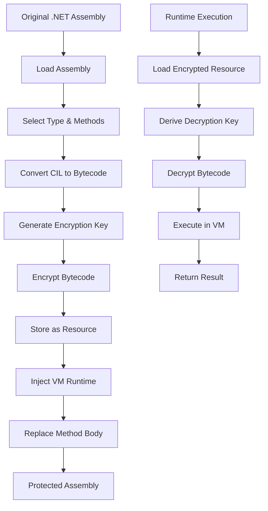
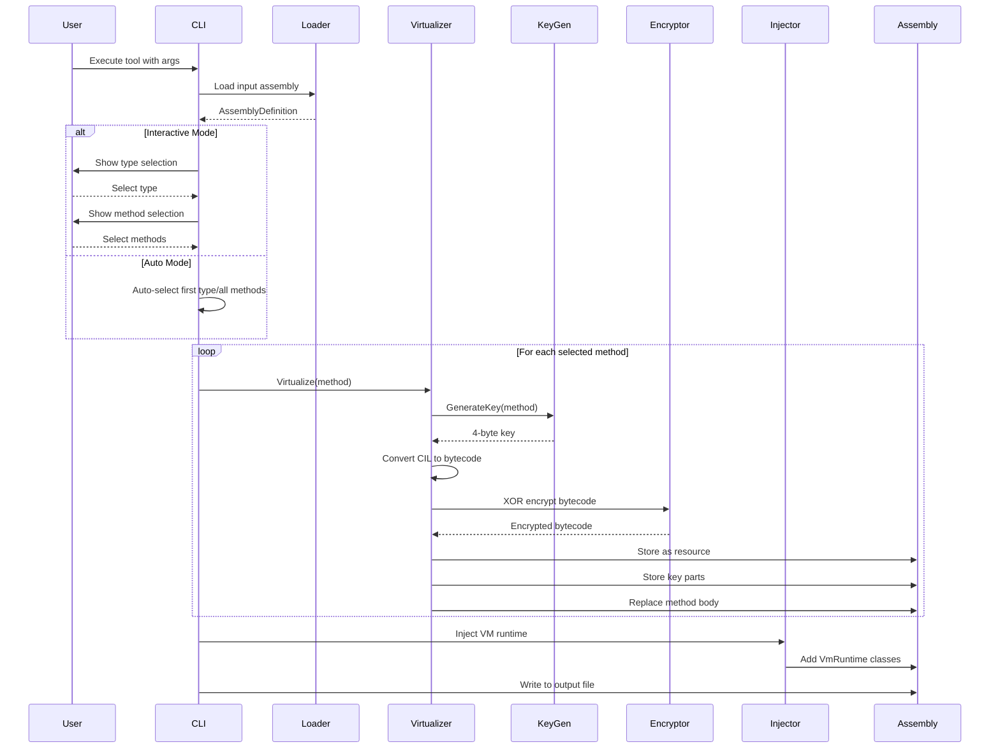
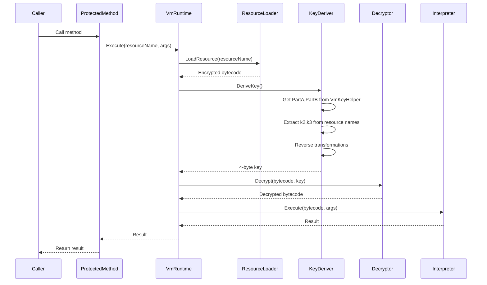
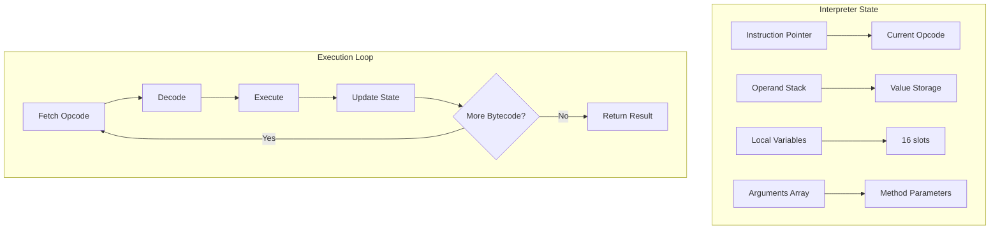

# PhantomExe.ILVirt.Tool

A sophisticated .NET IL Virtualization Protector that transforms CIL instructions into a custom bytecode format, encrypts them, and injects a VM runtime for secure execution.

## Overview

PhantomExe.ILVirt.Tool is a protection tool designed to obfuscate .NET assemblies by virtualizing method bodies. It converts CIL instructions to a custom bytecode format, encrypts them with method-specific keys, and injects a VM runtime that decrypts and executes the bytecode at runtime.

## Features

- **IL-to-Bytecode Conversion**: Translates CIL instructions to a custom bytecode format
- **Method-Specific Encryption**: Each method is encrypted with a unique 4-byte key derived from method metadata
- **VM Runtime Injection**: Injects a complete VM runtime into the target assembly
- **Resource-Based Storage**: Encrypted bytecode stored as embedded resources
- **Key Obfuscation**: Encryption keys split and obfuscated across multiple locations
- **Interactive Selection**: CLI interface for selecting types and methods to virtualize
- **Auto Mode**: Batch processing mode for automated virtualization

## Architecture

### System Overview

PhantomExe.ILVirt.Tool is a .NET assembly protection system that employs IL virtualization to obfuscate method implementations. The system transforms CIL instructions into a custom bytecode format, encrypts them, and injects a VM runtime that executes the bytecode at runtime.

#### High-Level Architecture


### Core Components

1. **MethodVirtualizer** - Converts CIL to bytecode and handles encryption
2. **VmRuntimeInjector** - Injects VM runtime classes into target assembly
3. **KeyGenerator** - Derives encryption keys from method metadata
4. **KeyConstantsEmitter** - Embeds key parts as constants in the assembly
5. **ResourceKeyEncoder** - Stores key parts in resource names
6. **Bytecode Interpreter** - Executes virtualized bytecode at runtime

### Virtualization Process



### Component Architecture

#### 1. Assembly Loader (`AssemblyLoader.cs`)
**Purpose**: Loads and inspects .NET assemblies using AsmResolver.

**Key Responsibilities**:
- Load assemblies from file system
- Extract root namespace from top-level types
- Provide assembly metadata access

**Dependencies**: AsmResolver 5.5.0

#### 2. Method Virtualizer (`MethodVirtualizer.cs`)
**Purpose**: Core virtualization engine that transforms CIL to bytecode.

**Key Responsibilities**:
- Convert CIL instructions to custom bytecode
- Handle branch target resolution
- Manage encryption/decryption
- Replace method bodies with VM calls

**Key Methods**:
- `Virtualize()`: Main entry point
- `IlToBytecode()`: CIL to bytecode conversion
- `ReplaceMethodBody()`: Replace CIL with VM call

#### 3. Bytecode Format (`BytecodeFormat.cs`)
**Purpose**: Defines the custom bytecode instruction set.

**Instruction Categories**:
- **Basic Operations** (0x00-0x0F): NOP, arithmetic
- **Load Constants** (0x10-0x1F): Strings, integers
- **Variable Access** (0x20-0x3F): Arguments, locals
- **Comparison** (0x40-0x4F): Equality, relational
- **Branching** (0x50-0x5F): Conditional/unconditional jumps
- **Control Flow** (0xFF): Return

#### 4. Key Management System

##### Key Generator (`KeyGenerator.cs`)
```mermaid
graph LR
    A[Method Metadata] --> B[Token + Type Hash]
    B --> C[Random Entropy]
    C --> D[SHA-256 Hash]
    D --> E[4-Byte Key]
    
    subgraph "Key Components"
        E --> F[k0: hash[0]^hash[8]^0x5A]
        E --> G[k1: hash[4]^hash[12]^0xC3]
        E --> H[k2: hash[16]^nameLength]
        E --> I[k3: hash[24]^paramCount]
    end
```

##### Key Storage Components
- **KeyConstantEmitter**: Embeds k0,k1 (transformed) in `VmKeyHelper` static fields
- **ResourceKeyEncoder**: Stores k2,k3 in resource names using XOR encoding

#### 5. VM Runtime System

##### VmRuntimeInjector (`VmRuntimeInjector.cs`)
**Purpose**: Injects VM runtime classes into target assembly.

**Process**:
1. Generate C# source code for VM runtime
2. Compile using Roslyn to temporary assembly
3. Extract types and methods
4. Inject into target assembly using AsmResolver
5. Fix type references and remove temporary assembly reference

##### VmRuntimeSource (`VmRuntimeSource.cs`)
**Purpose**: Contains template source code for VM runtime.

**Key Classes**:
- **VmRuntime**: Main entry point with `Execute()` method
- **Interpreter**: Stack-based bytecode execution engine
- **VmKeyHelper**: Static class for key storage (created separately)

#### 6. Resource Management
**Purpose**: Store encrypted bytecode and key components.

**Resource Types**:
1. **Bytecode Resources**: `PhantomExe.BC.{MetadataToken:X8}`
   - Contains encrypted method bytecode
   - XOR encrypted with 4-byte key

2. **Decoder Resources**: `PhantomExe.Decoder.{char2}{char3}`
   - Contains encoded k2 and k3 components
   - `char2 = k2 ^ 0x9E`, `char3 = k3 ^ 0xD1`

### Data Flow

#### Protection Phase Data Flow



#### Runtime Execution Data Flow



### Key Management

#### Key Generation Algorithm

```csharp
public static byte[] GenerateKey(MethodDefinition method)
{
    // 1. Generate random entropy
    var entropy = new byte[16];
    RandomNumberGenerator.Fill(entropy);
    
    // 2. Mix with method metadata
    var tokenBytes = BitConverter.GetBytes(method.MetadataToken.ToInt32());
    var typeHash = method.DeclaringType?.FullName?.GetHashCode() ?? 0;
    var typeHashBytes = BitConverter.GetBytes(typeHash);
    
    // 3. Create SHA-256 hash
    using var sha = SHA256.Create();
    var hash = sha.ComputeHash(entropy);
    
    // 4. Extract 4-byte key with transformations
    return new byte[]
    {
        (byte)(hash[0] ^ hash[8] ^ 0x5A),    // k0
        (byte)(hash[4] ^ hash[12] ^ 0xC3),   // k1
        (byte)(hash[16] ^ (byte)method.Name!.Length),  // k2
        (byte)(hash[24] ^ (byte)method.Parameters.Count) // k3
    };
}
```

#### Key Storage Strategy

| Component | Storage Location | Transformation | Purpose |
|-----------|------------------|----------------|---------|
| **k0** | `VmKeyHelper.PartA` | `k0 ^ 0x5A` | First key byte (transformed) |
| **k1** | `VmKeyHelper.PartB` | `k1 ^ 0xC3` | Second key byte (transformed) |
| **k2** | Resource name char2 | `k2 ^ 0x9E` | Third key byte (encoded) |
| **k3** | Resource name char3 | `k3 ^ 0xD1` | Fourth key byte (encoded) |
| **Bytecode** | Embedded resource | XOR with key | Encrypted method implementation |

#### Key Reconstruction at Runtime

```csharp
private static byte[] DeriveKey()
{
    // 1. Get transformed parts from VmKeyHelper
    byte partA = VmKeyHelper.PartA;  // Contains (k0 ^ 0x5A)
    byte partB = VmKeyHelper.PartB;  // Contains (k1 ^ 0xC3)
    
    // 2. Reverse transformations
    byte k0 = (byte)(partA ^ 0x5A);
    byte k1 = (byte)(partB ^ 0xC3);
    
    // 3. Extract encoded parts from resource names
    byte k2, k3;
    ExtractResourceKeyParts(out k2, out k3);
    
    return new byte[] { k0, k1, k2, k3 };
}
```

### Bytecode Format

#### Instruction Encoding

##### Basic Structure
```
[OPCODE][OPERAND...]
```

##### Operand Types
- **No operand**: `OP_NOP`, `OP_ADD`, `OP_SUB`, etc.
- **1-byte operand**: `OP_LDARG`, `OP_LDLOC`, `OP_STLOC` (index)
- **4-byte operand**: `OP_LDC_I4` (int32), branches (offset)
- **Variable-length**: `OP_LDC_STR` (2-byte length + UTF-8 data)

#### Branch Target Resolution
```csharp
// During compilation: Build offset map
var offsetMap = new Dictionary<int, int>();
int currentOffset = 0;
foreach (var instr in method.CilMethodBody.Instructions)
{
    offsetMap[instr.Offset] = currentOffset;
    currentOffset += GetBytecodeSize(instr);
}

// Write branch target
WriteBranchTarget(writer, instr, offsetMap);
```

#### Supported CIL to Bytecode Mappings

| CIL Instruction | Bytecode | Notes |
|-----------------|----------|-------|
| `ldc.i4` | `OP_LDC_I4` + int32 | All ldc.i4 variants supported |
| `ldstr` | `OP_LDC_STR` + length + UTF-8 | String constants |
| `ldarg.*` | `OP_LDARG` + index | All ldarg variants |
| `ldloc.*` | `OP_LDLOC` + index | All ldloc variants |
| `stloc.*` | `OP_STLOC` + index | All stloc variants |
| `add`/`sub`/`mul`/`div`/`rem` | `OP_ADD`/etc. | Arithmetic operations |
| `ceq`/`cgt`/`clt` | `OP_CEQ`/etc. | Comparisons |
| `br`/`brtrue`/`brfalse` | `OP_BR`/etc. + offset | Branching |
| `beq`/`bne`/`bgt`/etc. | `OP_BEQ`/etc. + offset | Conditional branches |
| `dup`/`pop` | `OP_DUP`/`OP_POP` | Stack operations |
| `ret` | `OP_RET` | Method return |

### VM Runtime

#### Stack-Based Interpreter Architecture



#### Interpreter Implementation Details

##### Stack Management
```csharp
public static object Execute(byte[] bytecode, object[] args)
{
    var stack = new Stack<object>();
    var locals = new object[16];
    int ip = 0;
    
    while (ip < bytecode.Length)
    {
        byte op = bytecode[ip++];
        
        switch (op)
        {
            case BytecodeFormat.OP_LDC_I4:
                int value = BitConverter.ToInt32(bytecode, ip);
                ip += 4;
                stack.Push(value);
                break;
                
            case BytecodeFormat.OP_ADD:
                var b = stack.Pop();
                var a = stack.Pop();
                // Type-based addition
                if (a is int ia && b is int ib)
                    stack.Push(ia + ib);
                // ... handle other types
                break;
                
            // ... other opcodes
        }
    }
}
```

#### Type Handling
The interpreter performs runtime type checking and operations:
- **Integers**: `int` and `long` support
- **Floating-point**: `float` and `double` (partial)
- **Strings**: UTF-8 encoded
- **Booleans**: As integers (0=false, 1=true)
- **Objects**: Reference type support via boxing

#### Memory Management
- **Stack**: Unlimited depth (limited by .NET Stack<T>)
- **Locals**: Fixed 16 slots (expandable by modification)
- **Arguments**: Passed as object array from caller

## Installation

### Prerequisites

- .NET 8.0 SDK
- Visual Studio 2022 or compatible IDE

### Build from Source

```bash
git clone <repository-url>
cd src/PhantomExe.ILVirt.Tool
dotnet restore
dotnet build -c Release
```

## Usage

### Basic Usage

```bash
PhantomExe.ILVirt.Tool.exe input.dll output.dll
```

### Interactive Mode

1. Run the tool with input and output paths
2. Select a type from the list
3.